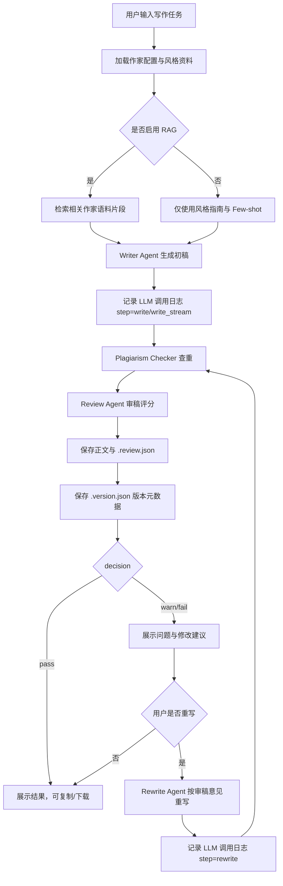
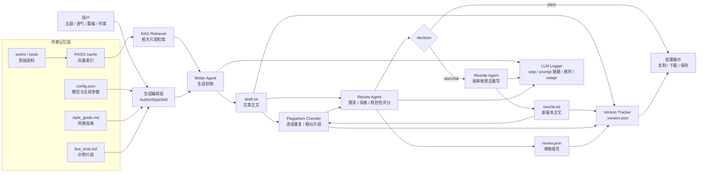

# StyleMuse ✍️

> 上传任意作家的作品，AI 自动学习其写作风格，生成原创仿写散文。

StyleMuse 是一个基于 RAG（检索增强生成）的作家风格仿写系统。只需上传 epub 或 txt 文件，系统会自动分析写作风格、构建向量索引，然后模仿该作家的笔触生成原创文章。

支持所有兼容 OpenAI API 的大模型（DeepSeek、通义千问、智谱、MiniMax、OpenAI 等），模型列表完全由用户自定义。

## ✨ 功能特性

- **一键创建作家 Skill** — 上传 epub/txt，自动分析风格、构建向量索引
- **风格分析** — 基础统计 + LLM 深度分析，自动生成风格指南和示例片段
- **RAG 检索增强** — 从作家作品中检索相关片段，辅助生成更地道的仿写
- **防抄袭机制** — 碎片化分块 + 检索过滤 + 生成后重复检测 + Prompt 约束，降低照搬风险
- **多模型支持** — DeepSeek / 通义千问 / 智谱 / MiniMax / OpenAI 等，用户可自由配置
- **Web 界面** — 可视化操作，支持文件上传、在线写作、模型配置、文件下载
- **CLI 命令行** — 适合批量生成和脚本集成
- **Python API** — 可作为库集成到其他项目

## 🚀 快速开始

### 1. 克隆项目

```bash
git clone https://github.com/<your-username>/stylemuse.git
cd stylemuse
```

### 2. 安装依赖

```bash
pip install -r requirements.txt
```

### 3. 配置模型

复制配置模板并填入你的 API 密钥：

```bash
cp .env.example .env
```

编辑 `.env`：

```env
# 大语言模型（以 DeepSeek 为例）
LLM_PROVIDER=openai
LLM_MODEL=deepseek-chat
LLM_BASE_URL=https://api.deepseek.com/v1
LLM_API_KEY=sk-xxxxxxxxxxxxxxxx

# Embedding 模型（千问）
EMBEDDING_PROVIDER=dashscope
EMBEDDING_MODEL=text-embedding-v3
EMBEDDING_API_KEY=sk-xxxxxxxxxxxxxxxx
```

也可以启动后在 Web 界面的「模型配置」页面直接编辑。

### 4. 启动

```bash
# Web 界面
python app.py
# 浏览器访问 http://localhost:5000

# 或使用 CLI
python main.py write --author liu_liangcheng --topic "故乡的狗"
```

### Smoke check

```bash
python scripts/smoke_check.py
```

The smoke check starts the Flask app on `127.0.0.1:5050`, verifies `/`,
`/api/models`, and `/api/authors`, then shuts the server down.

### LLM 调用日志

大模型调用会写入 `logs/stylemuse.log`。日志按 `request_id` 串联同一次调用，
并记录 `step`、模型摘要、prompt 长度、返回字符数、返回预览、usage metadata、
response metadata、耗时和异常信息。API Key 等敏感字段会自动脱敏。

## Agent 闭环逻辑

StyleMuse 的生成链路不是单次“输入主题 -> 返回文章”，而是一个可追踪的
Writer Agent + Review Agent + Rewrite Agent 闭环。目标是在保持作家风格的同时，
把需求符合度、风格相似度和抄袭风险纳入同一个质量控制流程。

### 核心角色

- **Writer Agent**：根据主题、语气、篇幅、作家风格指南和 RAG 检索片段生成初稿。
- **Plagiarism Checker**：对生成内容和作家原始语料做重复片段、相似片段检测。
- **Review Agent**：审查初稿是否满足主题、篇幅、语气、风格和原创性要求，输出结构化评分与修改建议。
- **Rewrite Agent**：当审稿结果为 `warn` 或 `fail` 时，根据审稿意见重写文章，并重新进入检测与审稿流程。
- **LLM Logger**：记录每次大模型调用的 `step`、输入输出摘要、耗时、metadata 和异常，便于定位问题。
- **Version Tracker**：为初稿和重写稿保存 `.version.json`，记录父版本、评分摘要、查重摘要和生成参数。

### 闭环步骤

1. 用户选择作家、主题、语气、篇幅和是否启用 RAG。
2. 系统加载作家配置、`style_guide.md`、`few_shot.md` 和向量索引。
3. Writer Agent 生成初稿，并将调用过程写入 `logs/stylemuse.log`。
4. Plagiarism Checker 检查连续重复、相似片段和潜在照搬风险。
5. Review Agent 输出 `decision`、`score`、`requirement`、`style`、`plagiarism` 和 `suggestions`。
6. 前端展示文章、查重结果和审稿意见，同时保存正文、`.review.json` 和 `.version.json`。
7. 如果用户点击“按审稿意见重写”，Rewrite Agent 会结合原文和审稿意见生成新版本。
8. 新版本再次执行查重与审稿，并通过 `parent_version` 串联版本链，形成“生成 -> 审查 -> 重写 -> 再审查”的闭环。

### 版本元数据

每次生成都会在正文旁保存一个 `.version.json` 文件，典型字段包括：

- `version_id`：当前版本标识，默认使用正文文件名。
- `kind`：`draft` 或 `rewrite`。
- `parent_version`：上一版版本标识，初稿为空。
- `review_summary`：审稿结论、总分、需求分、风格分、抄袭风险等摘要。
- `plagiarism_summary`：查重是否通过、最长连续重复、相似片段数量等摘要。
- `request`：语气、篇幅、是否启用 RAG、模型名、温度、最大 token 等非敏感生成参数。

### 决策规则

- `pass`：文章基本满足需求，抄袭风险低，可直接使用或轻微润色。
- `warn`：存在风格、篇幅、主题呼应或相似度问题，建议重写或人工修改。
- `fail`：主题/篇幅严重不符，或抄袭风险高，不建议直接使用。

### 流程图



### Agent 闭环职责图



这张图对应代码中的核心模块：

- `AuthorStyleSkill`：负责加载作家配置、组织 RAG、调用写作/重写/审稿链路。
- `Writer Agent`：由 `write` / `write_stream` 触发，生成初稿。
- `Plagiarism Checker`：由 `check_plagiarism` 执行重复片段和相似度检查。
- `Review Agent`：由 `review_article` 输出结构化评分、风险等级和修改建议。
- `Rewrite Agent`：由 `rewrite` 根据审稿意见生成新版本，并再次进入检查闭环。
- `Version Tracker`：保存 `.version.json`，串联初稿、重写稿、审稿摘要和查重摘要。
- `LLM Logger`：记录大模型调用链路，便于定位 prompt、模型、耗时和异常问题。

### 5. Docker 部署（可选）

使用 Docker Compose 一键启动：

```bash
# 构建并启动
docker-compose up -d --build

# 查看日志
docker-compose logs -f

# 停止服务
docker-compose down
```

> **注意：** 确保 `.env` 文件已配置好 API 密钥，`authors/` 目录用于持久化作家数据。

## 📖 使用方式

### Web 界面

启动 `python app.py` 后访问 http://localhost:5000：

**写作工坊** — 选择作家 → 输入主题 → 选择风格/长度 → 点击写作 → 复制或下载

**作家管理** — 上传 epub/txt 文件创建新作家，查看已有作家列表

**模型配置** — 编辑 `.env` 配置，管理自定义模型列表（点击模型可快速填入配置）

### CLI

```bash
# 创建作家（自动分析风格 + 构建向量索引）
python main.py create --name "鲁迅" --source ./luxun_files/

# 仿写
python main.py write --author "鲁迅" --topic "故乡" --tone philosophical --length long

# 列出所有作家
python main.py list

# 查看作家详情
python main.py info --author liu_liangcheng

# 删除作家
python main.py delete --author "鲁迅"
```

### Python API

```python
from skills.author_style import AuthorStyleSkill, create_author

# 创建新作家
create_author("鲁迅", source_path="./luxun_files/")

# 加载并写作
skill = AuthorStyleSkill("鲁迅")
article = skill.write(topic="故乡", tone="philosophical", length="medium")

# 批量生成
results = skill.write_batch(topics=["故乡", "风筝", "药"], tone="sharp")
```

## 🏗️ 项目结构

```
stylemuse/
├── app.py                           # Flask Web 服务
├── main.py                          # CLI 入口
├── requirements.txt
├── .env.example                     # 配置模板
│
├── static/                          # 前端
│   ├── index.html
│   ├── style.css
│   └── app.js
│
├── skills/
│   └── author_style/                # 核心 Skill 包
│       ├── config.py                # 配置（多模型支持）
│       ├── loader.py                # 文本加载与分块
│       ├── epub_loader.py           # EPUB 解析
│       ├── analyzer.py              # 风格分析器
│       ├── rag_chain.py             # RAG 链 + LLM
│       ├── style_prompt.py          # Prompt 模板
│       └── author_manager.py        # 作家管理
│
├── authors/                         # 作家工作空间
│   └── liu_liangcheng/              # 演示案例
│
└── docs/                            # 技术文档
```

每位作家拥有独立工作空间：

```
authors/<name>/
├── config.json          # 作家配置
├── style_guide.md       # 风格指南
├── few_shot.md          # 示例片段
├── works/               # txt 语料
├── epub/                # epub 书籍
├── cache/               # 向量索引 + 缓存
└── output/              # 生成的文章
```

## ⚙️ 支持的模型

所有兼容 OpenAI API 的模型均可使用。默认预置以下模型（可在 Web 界面自由增删）：

| 模型 | Provider | Model Name | Base URL |
|------|----------|------------|----------|
| DeepSeek | openai | deepseek-chat | https://api.deepseek.com/v1 |
| 通义千问 | openai | qwen-turbo | https://dashscope.aliyuncs.com/compatible-mode/v1 |
| 智谱 GLM | openai | glm-4-flash | https://open.bigmodel.cn/api/paas/v4 |
| MiniMax | anthropic | MiniMax-M2.7 | https://api.minimaxi.com/anthropic |
| OpenAI | openai | gpt-4o | (默认) |

在 Web 界面的「模型配置」页面可以：
- 点击模型卡片快速填入配置
- 添加自定义模型（任意 OpenAI 兼容接口）
- 删除不需要的模型
- 直接编辑 `.env` 中的 API 密钥等配置

## 🛡️ 防抄袭机制

1. **碎片化分块** — 每个文本块仅 100 字，避免大段复制
2. **检索过滤** — 根据 FAISS 距离保留相关片段
3. **随机打乱** — 打乱检索结果顺序，降低模仿痕迹
4. **生成后检测** — 与原始文本块比较连续重复字符和整体相似度
5. **Prompt 约束** — 明确要求 LLM 严禁整句照搬，连续重复字符不超过 15 个

## 🎯 演示案例

内置刘亮程（中国当代散文家）的完整数据作为演示：

```bash
python main.py write --author liu_liangcheng --topic "故乡的狗"
python main.py write --author liu_liangcheng --topic "春天的风" --tone humorous
python main.py write --author liu_liangcheng --topic "老家的树" --length long
```

## 📄 License

MIT
